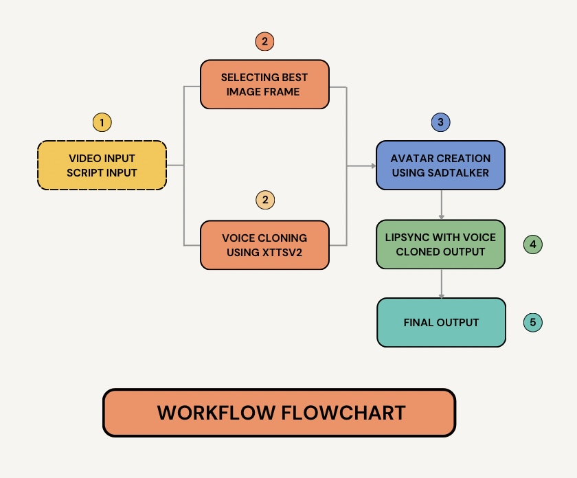

# AI Avatar Project
## Project Workflow



**Workflow Overview**: This flowchart illustrates the process of creating a lip-synced avatar video. It starts with video and script inputs, selects the best image frame, performs voice cloning, creates an avatar using SadTalker, and syncs the cloned voice to produce the final output.


## Working with External Files

This repository requires additional files that are stored in Google Drive due to their size . Please follow these steps after cloning the repository:

### 1. Access the Required Files
Access the Google Drive folder containing the necessary files:

- [Google Drive Link](https://drive.google.com/drive/folders/11-hDVYykqvAO32ehG8zoX-VbLTfbIgnT?usp=sharing)

### 2. Download the Required Folders
Download the following folders from the Google Drive:

- `sadtalker` — Contains SadTalker model files and resources
- `xtts` — Contains XTTS voice synthesis model and configuration

### 3. Copy Files to the Repository
After cloning the repository, copy the downloaded folders to their corresponding locations inside the project directory.

---

## Setting Up Environments for SadTalker and XTTS

Each of the downloaded folders (`sadtalker` and `xtts`) requires its own Python environment. Follow these steps:

### 1. Create a Virtual Environment

Navigate into each folder and create a separate virtual environment:

For **SadTalker**:
```bash
cd sadtalker
python -m venv sadtalkenv
```

For **XTTS**:
```bash
cd xtts
python -m venv ttsenv
```

> **Note**: Replace `python` with `python3` if needed, depending on your system setup.

### 2. Activate the Virtual Environment

Activate the virtual environment for each folder:

- **On Windows**:
  ```bash
  venv\Scripts\activate
  ```
- **On macOS/Linux**:
  ```bash
  source venv/bin/activate
  ```

### 3. Install Required Packages

Once the virtual environment is activated, install the dependencies:

```bash
pip install -r requirements.txt
```

Repeat the above steps separately for both the `sadtalker` and `xtts` folders.

---

> **Important**: Make sure you activate the correct environment whenever working inside each folder!

